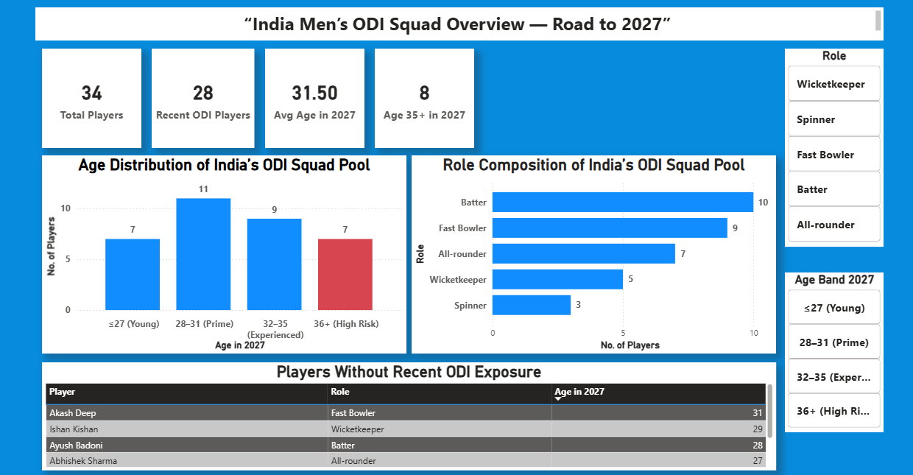
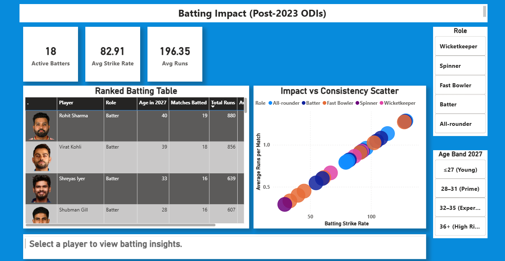
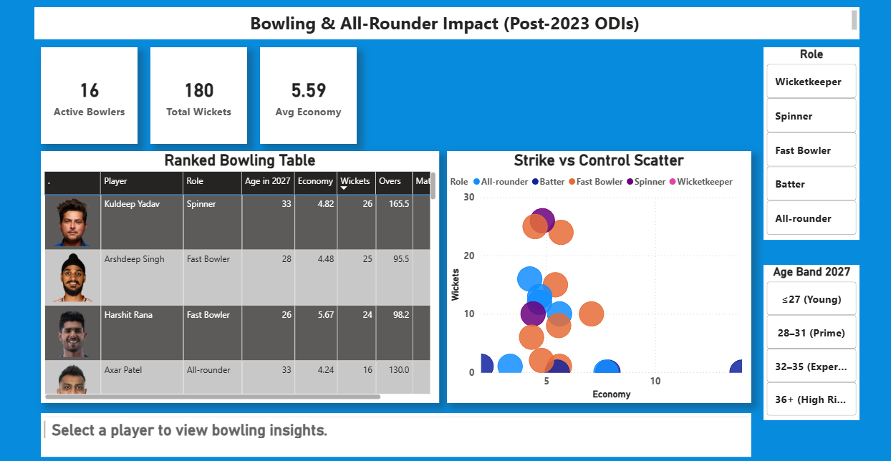
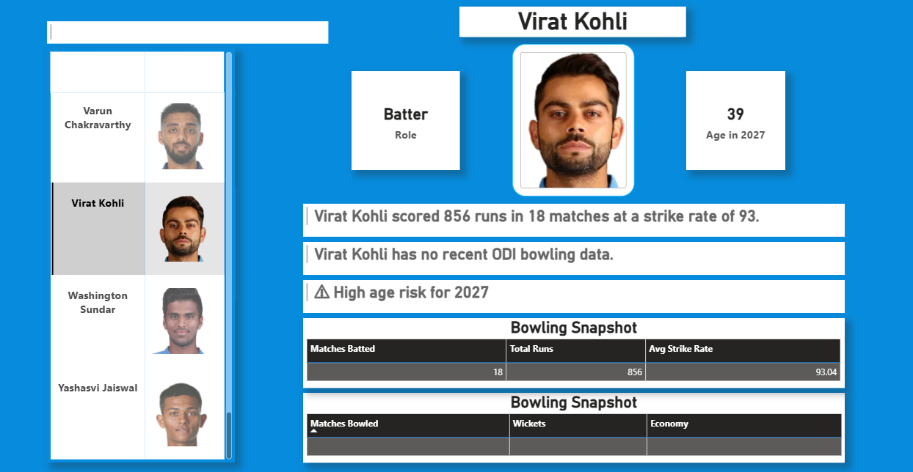
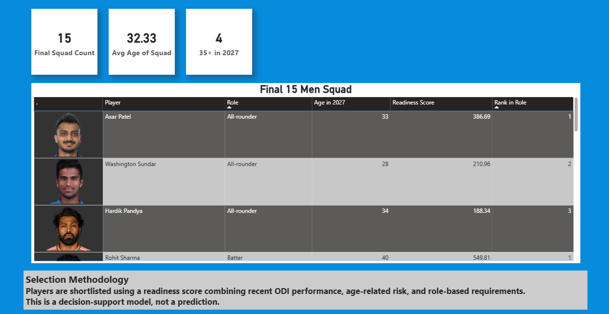

# 🏏 Road to 2027: India Men’s ODI World Cup Squad Analytics

## 📌 Project Overview
This project is an **end-to-end decision-support analytics solution** designed to evaluate and shortlist potential players for the **India Men’s 2027 ODI World Cup squad** using **post-2023 performance data**.

Rather than predicting a final squad using black-box models, the project focuses on **transparent, interpretable analytics** that mirror how real-world selection and planning decisions are made.

The output is an **interactive Power BI dashboard** that combines performance trends, age risk, role balance, and player-level insights to support data-driven discussions.

---

## 🎯 Objectives
- Transform raw ball-by-ball cricket data into **analysis-ready datasets**
- Evaluate **recent ODI performance** for batting and bowling
- Project **player age in 2027** to highlight long-term risk
- Design a **role-based readiness framework** for squad shortlisting
- Build **interactive BI dashboards** for exploration and comparison

---

## 📂 Data Sources
- **Cricsheet ODI ball-by-ball data**  
  - 1.3M+ deliveries across multiple matches  
- Player metadata:
  - Date of birth
  - Playing role
  - Recent ODI availability

All analysis is restricted to **post-2023 ODI matches involving India** to avoid legacy bias.

---

## 🔧 Data Preparation & Modeling
Key data engineering steps include:

- Validating and selecting correct delivery-level datasets
- Merging thousands of match-level CSV files
- Filtering India-specific batting and bowling deliveries
- Aggregating player-level metrics (runs, strike rate, wickets, economy)
- Harmonizing inconsistent player naming across sources
- Creating player metadata tables with DOB and role
- Engineering derived features:
  - Age in 2027
  - Age bands
  - Recent ODI availability flags

---

## 📊 Analytical Framework

### Squad Overview
- Role-wise composition
- Age distribution projected to 2027
- Identification of age and availability risks

### Batting Impact Analysis
- Runs, strike rate, and matches played
- Impact vs consistency comparisons
- Identification of high-impact batters using recent data only

### Bowling Impact Analysis
- Wickets, economy rate, and overs bowled
- Differentiation between strike bowlers and control bowlers
- Role-aware evaluation instead of raw totals

### Player Snapshot
- Interactive player-level profiling
- Batting and bowling summaries
- Human-readable insight text
- Age-risk and data-availability indicators
- Image-based player selection for improved UX

---

## 🏏 Final 15-Man Squad Logic
A **role-balanced 15-player shortlist** is generated using:

- Recent ODI performance metrics
- Age-risk penalties
- Role-based ranking (players compete within roles, not overall)
- Transparent readiness scoring (no predictive ML)

This produces a **data-backed shortlist** intended for discussion and planning — not prediction.

---

## 🛠 Tools & Technologies
- **Python**: pandas, numpy (data cleaning, aggregation, feature engineering)
- **Power BI**:
  - DAX (calculated columns, ranking, flags)
  - Data modeling
  - Interactive dashboard design
- **Data Analytics Skills**:
  - Decision-support analytics
  - BI storytelling
  - UX-focused dashboard design

---

## ⚠️ Important Note
This project is **not a predictive model**.

It is a **decision-support framework** that prioritizes:
- Interpretability
- Realistic constraints
- Transparency of assumptions

The methodology reflects how analytics is typically used in **business and sports decision-making contexts**.

---

## 📸 Dashboard Preview






---

## 🚀 Key Takeaways
- Demonstrates handling of **large, messy, real-world datasets**
- Shows strong **BI modeling and DAX fundamentals**
- Focuses on **decision-making, not just visualization**
- Highlights transferable skills applicable to **BI Developer and Data Analyst roles**

---

## 🏁 Conclusion
This project demonstrates how complex, real-world data can be transformed into **decision-ready insights** using structured data modeling, clear assumptions, and interactive BI design.

Rather than predicting outcomes, the focus is on **supporting transparent, explainable decisions** — a principle that applies equally to business intelligence and analytics use cases beyond sports.

The techniques used in this project are directly transferable to **BI Developer and Data Analyst roles** involving prioritization, risk assessment, and stakeholder-facing dashboards.

---

## 👤 Author
**Muhammed Nafih**  
Data Analyst | BI Developer

🔗 **LinkedIn:**  
https://www.linkedin.com/in/nafihhmohd/

---

## ▶️ How to Run
1. Clone the repository  
   ```bash
   git clone https://github.com/nafihhmohd/odi-wc-2027-squad-analytics.git
